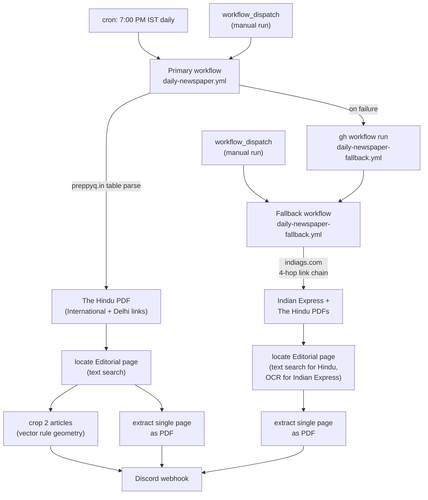
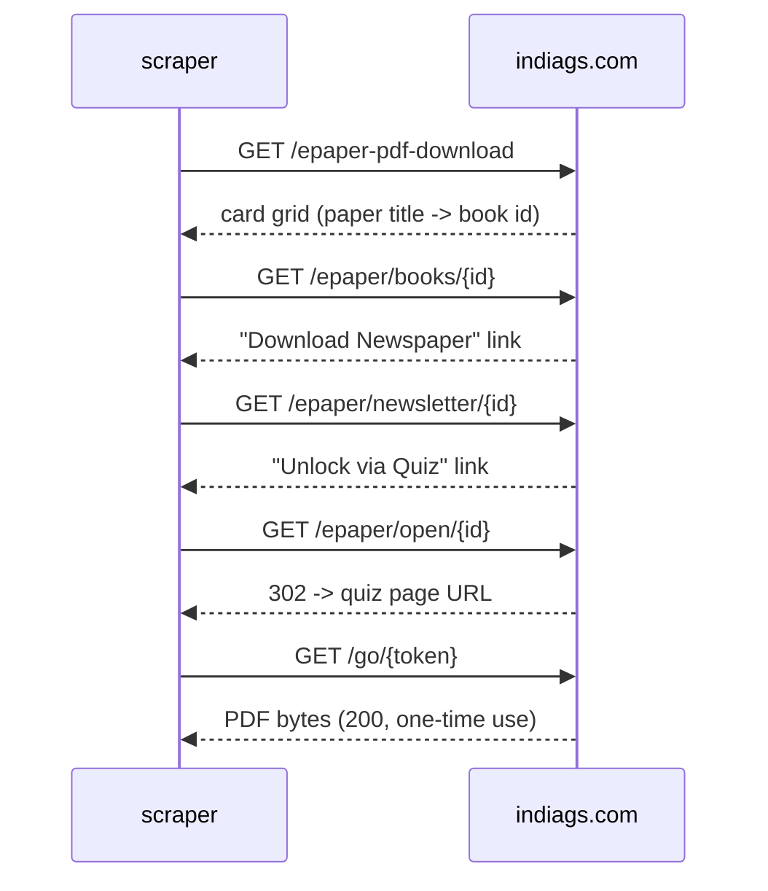
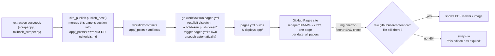

# E-Paper Editorial Extractor

Pulls the Editorial page out of today's **The Hindu** and **Indian Express** e-papers and posts it to Discord — the single page as a PDF, plus (for The Hindu) each main article cropped out as its own image. Runs on a GitHub Actions cron, no server to maintain.

[](https://www.python.org/)
[](LICENSE)

## How it works

Two independent GitHub Actions workflows, one primary and one fallback. Both are plain HTTP scrapers — no Selenium, no headless browser, no Chrome install. Every source page involved is either static server-rendered HTML or a direct file link; nothing here needs JavaScript execution.



### Primary: preppyq.in

`scraper.py` fetches `https://preppyq.in/the-hindu-newspaper/`, a static WordPress page whose first table lists direct PDF links for today's date (`requests` + `BeautifulSoup`, no rendering needed). Both editions' links are read; **International** is downloaded for extraction (fewer ads than Delhi, identical editorial content) with Delhi kept as the alternate if International isn't listed that day.

The Editorial page is located by text: The Hindu's PDF has a clean text layer, and its masthead always carries a standalone line reading exactly `Editorial` near the top of the page. If no page matches, the paper didn't run an editorial that day (Sunday, holiday) and the run skips cleanly rather than guessing.

Article cropping uses the PDF's own vector geometry, not pixel analysis. `PyMuPDF`'s `get_drawings()` returns the exact rules the page was laid out with:

- a full-height vertical rule marks off the left sidebar (short filler pieces) — excluded
- horizontal rules within the remaining content column bound each article, in order
- The Hindu always runs exactly two main articles on this page, followed by Letters to the Editor, which is dropped unconditionally

Each article is rendered to a high-resolution PNG from its exact rule-bounded region. The full Editorial page is also saved as its own small single-page PDF. Both edition URLs, the two article PNGs, and the single-page PDF are posted to Discord together.

### Fallback: indiags.com

Only runs if the primary workflow fails, or when triggered manually. `fallback_scraper.py` covers both papers by walking a four-hop link chain per paper, entirely with `requests`:



The site's UI wraps this in a quiz-unlock button, a 15-second countdown banner, and assorted popups — all client-side theater. The server embeds the one-time download token in the redirect response the moment `/epaper/open/{id}` is requested, regardless of whether a human ever clicks anything. The `/go/{token}` link is genuinely single-use: a second request against the same token returns an HTML page instead of the PDF, so it's fetched exactly once and streamed straight into the extraction step, never posted as a raw link.

Editorial-page location differs per paper because their PDFs are structured differently:

- **The Hindu** — same clean text layer as the primary source, same exact-line match on `Editorial`.
- **Indian Express** — the PDF page is a single flattened JPEG with a broken, non-Unicode-mapped text layer (glyph-indexed font, unusable for search). Located instead by OCR: the top 20% of each page is rendered and read with `pytesseract`, matching a short standalone line reading `The Editorial Page`. The length check matters — the front page also carries a teaser banner ("*The Editorial Page: SC has nurtured environmental law...*") pointing readers to the real page, which contains the same phrase but as a long sentence with a colon, not a bare masthead line. Matching only short lines tells them apart reliably.

The Hindu's indiags PDF carries the same vector rule geometry as the primary source, so it gets the same two-article crop here. Indian Express stays single-page-PDF-only: its indiags PDF is a flattened raster page with no vector drawings, and no printed rule line is reliably detectable at the pixel level either (tested down to per-row dark-run analysis at 200 DPI — the section dividers visible on the printed page don't survive as a clean signal in the compressed raster). Rule-based article cropping just isn't viable there with either source.

## The site

Both scripts publish into a single Jekyll post per date (`site_publish.py`), so the day's output — however many papers ran, from either source — lands on one page instead of one per paper, on a small static site (`app/`, a customized [jekyll-swiss](https://github.com/broccolini/swiss) theme) in addition to Discord.



**One post per date, not per paper.** `app/_posts/YYYY-MM-DD-editorials.md` is built from marked-off per-paper sections (`<!-- paper-section:TH -->...<!-- /paper-section:TH -->`); each script re-runs only replaces its own paper's section, in a fixed order, so primary and fallback (and Hindu vs. Indian Express) never stomp on each other regardless of which ran first or how many times. URL is `/epaper/DD-MM-YYYY/` (`permalink: /epaper/:day-:month-:year/` in `_config.yml`), title "Editorials of DD/MM/YYYY". Content per paper: H1 paper name, H2 sections (Editions/Editorial/Articles as applicable), a download-button table (`app/_includes/download-button.html`, using `app/assets/download.svg`) for every downloadable file, and an inline PDF preview.

**PDF preview is a self-hosted PDF.js** (`app/assets/pdfjs/`, vendored from [mozilla/pdf.js](https://github.com/mozilla/pdf.js) releases, trimmed of source maps/sample files/most locales down to English + Hindi), not a plain `<iframe src="raw-url">`. Directly framing a `raw.githubusercontent.com` URL doesn't reliably render inline — GitHub serves raw content with headers that push browsers toward downloading rather than displaying it. PDF.js sidesteps that: the iframe points at our own `web/viewer.html?file=<url-encoded raw URL>`, and PDF.js fetches the PDF bytes itself and renders to canvas — `raw.githubusercontent.com` allows CORS, so the fetch works regardless of how the response would have behaved as a page navigation.

Posts don't duplicate the PDF/PNG files into the site — they link straight to `raw.githubusercontent.com/.../artifacts/...` on `main`. That keeps `app/`'s per-day footprint tiny, at the cost of those links depending on the artifact still being in the repo. Since both `artifacts/` and `app/_posts/` are pruned on the same 7-day rolling window (`common.cleanup_stale_posts()`, alongside `cleanup_stale_artifacts()`), a post essentially never outlives its own artifact in steady state — the client-side expiry handling in `app/_includes/expiry-check.html` exists as a safety net for the brief window within a single cleanup cycle, not as the normal experience. When it does trigger: images swap to a placeholder via `onerror` (immediate, no request needed), and each download-button link runs a `fetch(..., {method: "HEAD"})` on page load and replaces itself with "This PDF has expired" if the request fails.

Site is deployed by `.github/workflows/pages.yml` (Jekyll build via `ruby/setup-ruby` + `actions/deploy-pages`, `jekyll-sass-converter` pinned to the pure-Ruby v2 line rather than the default `sass-embedded` for one less native-binary dependency in CI) on every push to `app/**`, manually via `workflow_dispatch`, or explicitly dispatched by both daily workflows' last step (needed because their own commits are pushed with `GITHUB_TOKEN`, which GitHub deliberately excludes from triggering other workflows' `on: push`). Browsing by date needs no custom code — `site.posts` is Jekyll's native reverse-chronological list; `/epaper/` (`app/epaper.html`) filters it to the `epaper` category. All post/history timestamps go through `common.now_ist()` and `_config.yml`'s `timezone: Asia/Kolkata`, not the build host's own clock (GitHub Actions runners default to UTC) — Jekyll normalizes every post date to the *build machine's* local timezone before deriving permalink components, so without pinning this explicitly, a post published in the early IST morning can silently land on the wrong calendar day.

**Article images**: The Hindu gets these from both sources (same vector-rule-geometry crop either way, since indiags' Hindu PDF carries the same drawn rule lines as the primary preppyq source). Indian Express is single-page-PDF-only — its indiags PDF is a flattened raster page with no vector drawings, and no printed rule line survives as a reliably-detectable signal in the compressed raster at the pixel level either (tested per-row dark-run analysis at 200 DPI scoped to the actual content bounding box), so rule-based article cropping isn't viable there with either source.

## Repo layout

```
epaper-automation/
├── scraper.py                              # primary: preppyq.in
├── fallback_scraper.py                     # fallback: indiags.com
├── editorial.py                            # shared: page location + extraction
├── common.py                               # shared: history, Discord posting, cleanup
├── site_publish.py                         # shared: writes app/_posts/ entries
├── download_history.json                   # per-paper daily dedup record
├── artifacts/YYYY-MM-DD/                   # today's extracted PDFs/PNGs (auto-pruned, 7 days)
│   ├── TH-EDITORIAL-DD-MM-YY.pdf           # single-page editorial PDF
│   ├── TH-ART1-DD-MM-YY.png                # article crop 1 (Hindu, both sources)
│   ├── TH-ART2-DD-MM-YY.png                # article crop 2 (Hindu, both sources)
│   └── IE-EDITORIAL-DD-MM-YY.pdf
├── app/                                     # Jekyll site (jekyll-swiss theme)
│   ├── _posts/YYYY-MM-DD-editorials.md     # one per date, all papers (auto-pruned, 7 days)
│   ├── epaper.html                          # /epaper/ -- browsable archive
│   ├── _includes/download-button.html      # reusable download link + expiry check hook
│   ├── _includes/expiry-check.html         # client-side expired-artifact handling
│   └── assets/pdfjs/                        # vendored PDF.js (self-hosted inline viewer)
├── requirements.txt
└── .github/workflows/
    ├── daily-newspaper.yml                 # primary: cron + manual dispatch
    ├── daily-newspaper-fallback.yml        # fallback: manual dispatch only (or auto-triggered on primary failure)
    └── pages.yml                           # builds + deploys app/ to GitHub Pages
```

## Setup

1. **Discord webhook** — Server Settings → Integrations → Webhooks → create one, copy the URL.
2. **Repo secret** — Settings → Secrets and variables → Actions → add `DISCORD_WEBHOOK_URL`.
3. Enable Actions on the repo. The primary workflow runs on its own cron; no further setup needed.
4. **GitHub Pages** — Settings → Pages → set Source to "GitHub Actions" (one-time; `pages.yml` handles builds after that).

For local runs, copy `.env.example` to `.env` or export `DISCORD_WEBHOOK_URL` directly, then:

```bash
pip install -r requirements.txt
python scraper.py            # primary
python fallback_scraper.py   # fallback
```

`pytesseract` needs the `tesseract-ocr` binary on PATH (`brew install tesseract` / `apt-get install tesseract-ocr`) — only exercised by the fallback path's Indian Express detection.

## Running manually

Both workflows can be triggered independently of their schedule from the **Actions** tab (`Run workflow`) or via `gh`:

```bash
gh workflow run daily-newspaper.yml
gh workflow run daily-newspaper-fallback.yml
gh workflow run pages.yml
```

The fallback is also dispatched automatically by the primary workflow's last step when the primary run fails. `pages.yml` also runs automatically on every push that touches `app/**` (which every extraction run does, via the new post file), so a manual run of it is rarely needed.

## History and artifact lifecycle

`download_history.json` is keyed `MM-YYYY -> YYYY-MM-DD -> paper name`, recording whether that paper was posted, skipped (no editorial published that day), or failed, plus which source/edition it came from. Both scripts check this before doing any work, so re-running a workflow the same day is a no-op for papers already posted.

Extracted files land in `artifacts/YYYY-MM-DD/`, named `{PAPER_CODE}-{DOC_TYPE}[N]-DD-MM-YY.{ext}` (`TH` for The Hindu, `IE` for Indian Express; `EDITORIAL` for the single-page PDF, `ART1`/`ART2` for the primary workflow's article crops) so the paper, content, and date are readable from the filename alone. They're committed by the workflow. Every run also prunes any date folder older than **7 days**, and the corresponding `app/_posts/` entries on the same window, so the repo stays a rolling week of history rather than accumulating indefinitely.

## Dependencies

`requests`, `beautifulsoup4`, `pymupdf`, `pytesseract`, `Pillow` — all pure-Python/HTTP, no browser runtime.

## License

See [LICENSE](LICENSE).
