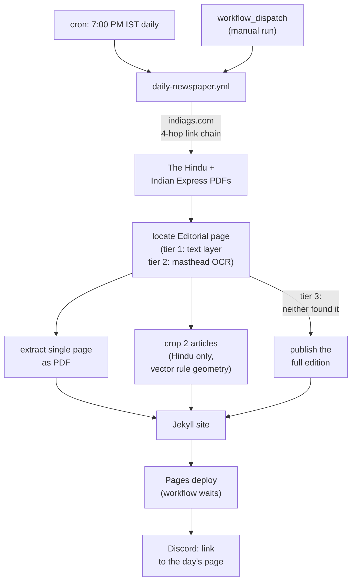
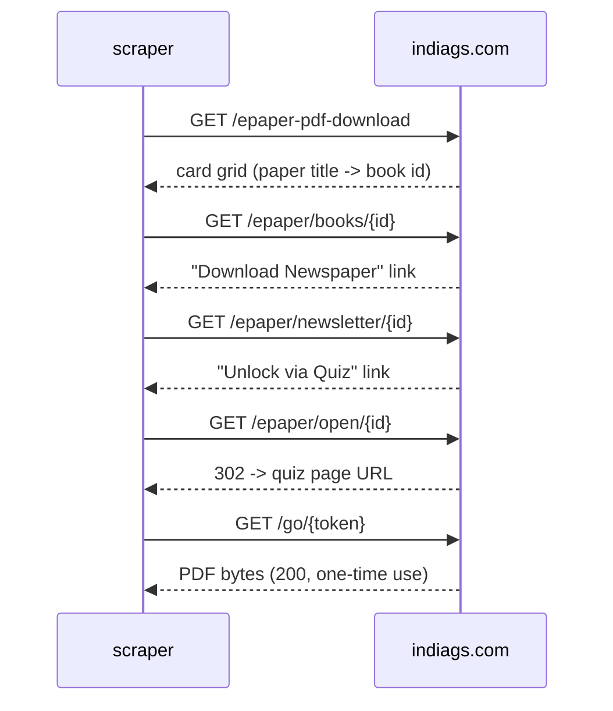
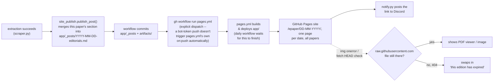

# E-Paper Editorial Extractor

Pulls the Editorial page out of today's **The Hindu** and **Indian Express** e-papers and posts it to Discord — the single page as a PDF, plus (for The Hindu) each main article cropped out as its own image. Runs on a GitHub Actions cron, no server to maintain.

[](https://www.python.org/)
[](LICENSE)

## How it works

One GitHub Actions workflow, one source (indiags.com), both papers. It's a plain HTTP scraper — no Selenium, no headless browser, no Chrome install. Every page in the chain is static server-rendered HTML or a direct file link; nothing here needs JavaScript execution.



### Source: indiags.com

`scraper.py` covers both papers by walking a four-hop link chain per paper, entirely with `requests`:



The site's UI wraps this in a quiz-unlock button, a 15-second countdown banner, and assorted popups — all client-side theater. The server embeds the one-time download token in the redirect response the moment `/epaper/open/{id}` is requested, regardless of whether a human ever clicks anything. The `/go/{token}` link is genuinely single-use: a second request against the same token returns an HTML page instead of the PDF, so it's fetched exactly once and streamed straight into the extraction step, never posted as a raw link.

**Parse the unlock fragment as a query string, not by splitting on `unlock=`.** The redirect fragment carries two keys — `unlock=<url-encoded /go/ link>&exp=<epoch>`. Taking everything after `unlock=` glues `&exp=...` onto the end of the token path, and every download 404s. `urllib.parse.parse_qs` on the fragment is what `resolve_token_url()` uses; assume the site will keep adding keys there.

**The session is IPv4-only with connect retries** (`build_session()`). indiags sits behind a Hostinger CDN publishing both A and AAAA records, and intermittently refuses connections from CI runners for a few minutes at a time. GitHub Actions runners have no IPv6 egress, so every AAAA address is a guaranteed `ENETUNREACH` — and since `urllib3`'s connect loop raises only the *last* error it saw, those IPv6 failures mask the real IPv4 error and make a plain CDN blip look like a routing bug. Pinning `allowed_gai_family` to `AF_INET` keeps the reported error honest, and the retry/backoff on the adapter keeps a transient blip from costing the whole day's run.

Editorial-page location is **tiered, and which tier runs is measured per document** rather than configured per paper (`editorial.locate_editorial_page()`):

1. **text** — the PDF's text layer decodes, so the masthead line is read straight out of it. Exact and fast (~0.4s for an 18-page edition). The match is gated on *where the line sits on the page*, not on its ordinal among extracted lines: text comes out in content-stream order, not top-to-bottom, so a stray caption block emitted first shifts every following line down by one. That is exactly what silently broke the original locator, which used a fixed `lines[:8]` window with the masthead sitting at index 7.
2. **ocr** — the text layer is missing or unusable, or tier 1 found nothing. The top 25% of each page is rendered at 200 DPI and read with `pytesseract`, stopping at the first hit (~20–40s). Neither number is a tuning knob: at 150 DPI tesseract missed The Hindu's masthead on a page 200 DPI read cleanly, and at a 15% strip the Indian Express masthead fell outside the crop entirely.
3. **full** — neither tier found it. The whole edition is published instead of skipping the paper; the PDF is in hand either way, and a reader would rather have the full paper than nothing.

`text_layer_usable()` is what picks the tier: the share of non-space extracted characters that decode to real text. The Hindu scores **1.00**; Indian Express scores **0.19** — it embeds every font as `Identity-H` with a `ToUnicode` CMap mapping every glyph to `U+FFFD`, so its text layer *exists* (~20k characters a page) but decodes to control bytes. The threshold sits in a very wide gap and needs no tuning. Measuring beats a hardcoded per-paper flag: it keeps picking the right tier if either paper changes its production pipeline.

Masthead patterns are matched against a **normalised** line — lowercased, every run of non-alphanumerics collapsed to one space — and must match it *in full*. Both parts earn their place. Normalisation, because OCR output is dirty in ways exact matching can't survive (The Hindu's masthead came back as `. Editorial =`). Full-line matching, because the decoys differ from the masthead in *words*, not punctuation: on 2026-09-18 the Indian Express edition carried `the editorial page release 2017 18 consumption data put all doubt to rest` (a front-page teaser), `naging editor and director of re` (masthead bleed) and `editorials and opinions` (a section strap), all rejected, with the real `the editorial page` found on page 14. Note the teaser was on **page 5** — skipping the first two pages is a cheap extra guard, not a sufficient one.

The Hindu's PDF carries vector rule geometry, so its two main articles are cropped from the page. `PyMuPDF`'s `get_drawings()` returns the exact rules the page was laid out with:

- a full-height vertical rule marks off the left sidebar (short filler pieces) — excluded
- horizontal rules within the remaining content column bound each article, in order
- The Hindu always runs exactly two main articles on this page, followed by Letters to the Editor, which is dropped unconditionally

Each article is rendered to a high-resolution PNG from its exact rule-bounded region. Indian Express stays page-PDF-only: `get_drawings()` returns nothing at all on its editorial page. The rules and photos a reader sees there live in a full-page background raster, with the text drawn as vector glyphs on top — so there is no rule geometry to crop against, and none is detectable at the pixel level either (tested down to per-row dark-run analysis at 200 DPI).

### Guardrails

Both real breakages so far were *silent* — a green workflow producing nothing. preppyq's paywall hid for six consecutive runs, and the `&exp=` change 404'd every download while the run still reported success. So the guards are aimed less at any particular future change than at the failure *mode*: looking fine while doing nothing.

**Link resolution is ranked by how stable the locator is** (`_resolve_link()`). The URL path shape (`/epaper/newsletter/{id}`) comes first — the author can't change it without breaking their own routing — with the CSS class and then the button label as fallbacks. The original code used only the last two, which is why a theme tweak or a copy edit would have taken the whole run down. Verified against mutated copies of the live homepage: stripping *every* `class` attribute, renaming all three card classes, and rewording the paper titles to "The Hindu ePaper" / "Indian Express (Delhi)" all still resolve correctly.

Which locator actually fired is recorded in history as `resolved_via`, and anything other than `url-shape` logs a warning. That's the early-warning signal: the fallbacks firing means the shape moved and the chain is running on borrowed time, visible *before* it breaks.

**The one-time `/go/` token is looked for in three places** (`_extract_go_url()`) — fragment as a query string, then the query string proper, then anything `/go/`-shaped in the response body. The site has already moved this once; parsing the fragment with `parse_qs` means further added keys are a non-event.

**Nothing is ever silently skipped.** The old behaviour recorded `skipped_not_published` whenever the locator found nothing, which is indistinguishable from the paper genuinely not running an editorial — and that ambiguity is what hid the last breakage for six days. Now the tiers themselves carry the diagnosis, recorded in history as `located_via`:

| `located_via` | meaning | alert |
|---|---|---|
| `text` | found in a usable text layer | — |
| `ocr` | text layer unusable, OCR found it | — (normal for Indian Express) |
| `ocr-fallback` | text layer *was* usable but didn't contain the masthead; OCR covered | **warning, day 1** |
| `full` | neither tier found it; whole edition published | **warning, day 1** |

`ocr-fallback` is the valuable one: that combination is only possible if the paper's text-layer layout moved, so the drift alarm fires on the first day it happens rather than after a streak of quiet skips — while the run still succeeds on the slow path.

**A run of full-edition fallbacks fails the run** (`common.consecutive_full_editions()`). One is survivable; three consecutive days means both tiers are dead, and each such day commits a multi-MB PDF into git history permanently. Two details matter — days with no entry are stepped over (the workflow doesn't run every day, and a gap is not evidence), and an entry from a different `source` ends the walk, so switching sources doesn't inherit the previous one's streak.

**The download is sanity-checked before it's treated as a paper** (`_validate_download()`): `Content-Type`, `%PDF` magic bytes, a 1 MB floor and an 8-page floor. The longest-hiding failure in this system was a *successful* download of the wrong thing — see below. The edition's printed dateline is also parsed and compared against today's date, warning (but still publishing) on a mismatch, which catches a source serving a cached or wrong-day edition.

**A tier-3 PDF is kept, not deleted.** The full edition stays in `artifacts/`, so the exact file that defeated both locators is available for diagnosis. The previous code deleted the download on the skip path, which is precisely why the last breakage couldn't be reproduced after the fact.

**Problems are reported, not delivered, by the scraper** (`common.report_problem()`). Nothing diagnostic goes to Discord — that webhook points at a public community server, so it stays single-purpose: posting editorials. Instead each problem is written to three places that need no secret at all — a GitHub Actions annotation (called out inline on the run page), `$GITHUB_STEP_SUMMARY` (so the run page explains itself), and `failure-report.md`.

The workflow turns that file into **a GitHub Issue**, which is what actually reaches an inbox: GitHub mails the full issue body from `notifications@github.com`, alongside the automated run-failure mail — whose own template can't carry custom text, which is why the issue exists at all. One open issue at a time, matched on exact title, so a break persisting for days adds comments rather than mailing a new issue every run; a later clean run comments "Recovered" and closes it. The issue step runs on success too, because the early-warning report fires while everything still works.

`HopError` also writes the offending page to `hop-{what}.html`, collected by the workflow's `upload-artifact` step — previously that step was dead, since nothing ever wrote a `*.html` file. None of these diagnostics are committed (they're in `.gitignore`, which matters because the workflow commits with `git add -A`).

**This needs Issues enabled on the repo.** The step runs with `issues: write` on the default `GITHUB_TOKEN`; if Issues are turned off, `gh issue list` fails and the step goes red.

### Why preppyq.in was dropped

The original primary source was `preppyq.in`, a static WordPress page listing direct PDF links for The Hindu. It went behind a paywall: the table's links now point at `rzp.io` Razorpay payment pages instead of PDFs. That failed *silently* — the scraper downloaded the payment page's HTML, found no `Editorial` text in it, and recorded the day as `skipped_not_published`, so the workflow kept reporting success while producing nothing. Removed entirely rather than kept as a fallback; a source that fails by looking like a quiet no-op is worse than no source.

## The site

The scraper publishes into a single Jekyll post per date (`site_publish.py`), so the day's output — however many papers ran — lands on one page instead of one per paper, on a small static site (`app/`, a customized [jekyll-swiss](https://github.com/broccolini/swiss) theme). The site *is* the delivery mechanism — Discord gets a link to it, not attachments.



**One post per date, not per paper.** `app/_posts/YYYY-MM-DD-editorials.md` is built from marked-off per-paper sections (`<!-- paper-section:TH -->...<!-- /paper-section:TH -->`); a re-run only replaces the section for the paper it just processed, in a fixed order, so The Hindu and Indian Express never stomp on each other regardless of which ran first or how many times. URL is `/epaper/DD-MM-YYYY/` (`permalink: /epaper/:day-:month-:year/` in `_config.yml`), title "Editorials of DD/MM/YYYY". Content per paper: H1 paper name, H2 sections (Editorial/Articles as applicable), a download-button table (`app/_includes/download-button.html`, using `app/assets/download.svg`) for every downloadable file, and an inline PDF preview.

**PDF preview is a self-hosted PDF.js** (`app/assets/pdfjs/`, vendored from [mozilla/pdf.js](https://github.com/mozilla/pdf.js) releases, trimmed of source maps/sample files/most locales down to English + Hindi), not a plain `<iframe src="raw-url">`. Directly framing a `raw.githubusercontent.com` URL doesn't reliably render inline — GitHub serves raw content with headers that push browsers toward downloading rather than displaying it. PDF.js sidesteps that: the iframe points at our own `web/viewer.html?file=<url-encoded raw URL>`, and PDF.js fetches the PDF bytes itself and renders to canvas — `raw.githubusercontent.com` allows CORS, so the fetch works regardless of how the response would have behaved as a page navigation.

One hand-patch on top of the vendored files: PDF.js's `viewer.mjs` hardcodes a same-origin check (`validateFileURL`) that only exempts Mozilla's own `mozilla.github.io` demo from loading a different-origin file via `?file=` — any other self-hosted deployment gets silently blocked (an empty viewer, no console-visible network failure, since it throws before ever fetching). Since every URL we pass is one we constructed ourselves from our own repo, never arbitrary input, our deployment origin (`https://mantavyam.github.io`, plus `http://localhost:4000` for local preview) is added to that allowlist directly in `app/assets/pdfjs/web/viewer.mjs` — the same trust model Mozilla applies to their own domain. **Re-apply this patch if `app/assets/pdfjs/` is ever re-vendored from a newer PDF.js release** — search `viewer.mjs` for `HOSTED_VIEWER_ORIGINS`.

Posts don't duplicate the PDF/PNG files into the site — they link straight to `raw.githubusercontent.com/.../artifacts/...`, served off the dedicated `artifacts` branch (see below). That keeps `app/`'s per-day footprint tiny, at the cost of those links depending on the artifact still being in the repo. Since both `artifacts/` and `app/_posts/` are pruned on the same 7-day rolling window (`common.cleanup_stale_posts()`, alongside `cleanup_stale_artifacts()`), a post essentially never outlives its own artifact in steady state — the client-side expiry handling in `app/_includes/expiry-check.html` exists as a safety net for the brief window within a single cleanup cycle, not as the normal experience. When it does trigger: images swap to a placeholder via `onerror` (immediate, no request needed), and each download-button link runs a `fetch(..., {method: "HEAD"})` on page load and replaces itself with "This PDF has expired" if the request fails.

Site is deployed by `.github/workflows/pages.yml` (Jekyll build via `ruby/setup-ruby` + `actions/deploy-pages`, `jekyll-sass-converter` pinned to the pure-Ruby v2 line rather than the default `sass-embedded` for one less native-binary dependency in CI) on every push to `app/**`, manually via `workflow_dispatch`, or explicitly dispatched by the daily workflow (needed because its own commit is pushed with `GITHUB_TOKEN`, which GitHub deliberately excludes from triggering other workflows' `on: push`). Browsing by date needs no custom code — `site.posts` is Jekyll's native reverse-chronological list; `/epaper/` (`app/epaper.html`) filters it to the `epaper` category. All post/history timestamps go through `common.now_ist()` and `_config.yml`'s `timezone: Asia/Kolkata`, not the build host's own clock (GitHub Actions runners default to UTC) — Jekyll normalizes every post date to the *build machine's* local timezone before deriving permalink components, so without pinning this explicitly, a post published in the early IST morning can silently land on the wrong calendar day.

### Discord gets a link, not files

`notify.py` posts one message per day — the date, which papers ran, and a link to `/epaper/DD-MM-YYYY/`. No attachments. The site already hosts every artifact behind a PDF.js viewer, so a link carries strictly more than an upload did (both papers in one message, article crops inline, working previews) while keeping the message small.

This is why it is a *separate script from a later workflow step*. The link points at a page that doesn't exist until the post has been committed, built and deployed; posting it from the extraction step would hand readers a URL that 404s for a minute or two. So `scraper.py` writes `notify.json`, the workflow commits, dispatches `pages.yml` and **waits for that deploy to conclude**, and only then runs `notify.py`. If the deploy fails or never starts, the step is skipped rather than posting a dead link.

Re-runs can't double-post, and it needs no extra state to manage that: `scraper.py` writes the manifest only when it actually published something, and a re-run for a date already in the history short-circuits on `already_processed()` before publishing. A re-run therefore leaves no manifest and `notify.py` no-ops.

Linked posts are pruned on the same 7-day window as the artifacts, so Discord links older than a week will 404. That's accepted — this is a rolling week of history, not an archive.

### Artifacts live on their own branch

`main`'s history was growing **~1.7 MB/day and could never shrink**. The 7-day prune keeps the working tree small, but every byte it deletes stays in git history forever — measured at 20.6 MB of artifact blobs across 12 dates, **85% of the whole repo**, with an empty `artifacts/` in the working tree. Left alone that's ~630 MB/year, unbounded.

So artifacts are committed to a separate `artifacts` branch instead, and `artifacts/` is `.gitignore`d on `main`. The workflow checks that branch out as a worktree (`.artifacts-worktree`) before extraction and points `ARTIFACTS_ROOT` at it, so `scraper.py` writes the rolling window straight into it — which also means `cleanup_stale_artifacts()` can see the older days it needs to prune, since they're no longer on `main` at all. `ARTIFACTS_DIR` is blanked there so the date folders sit at the branch root, keeping URLs as `/<repo>/artifacts/YYYY-MM-DD/...` rather than doubling the word.

The branch is **force-pushed as a single commit every run** (`commit-tree` with no parent). It's a rolling mirror of the live window; its history carries no information and would otherwise grow exactly as `main`'s did. Collapsing it each time bounds it permanently at one window's worth of files, and `main`'s history stops growing at all. Old blobs become unreachable — GitHub prunes those on its own schedule, so the *reported* repo size won't drop promptly; this stops the accumulation rather than reclaiming what's already there.

**Why not GitHub Releases** (the obvious place for build outputs): release assets send no `Access-Control-Allow-Origin` header, while `raw.githubusercontent.com` sends `*` on any branch. The site's PDF.js viewer fetches PDF bytes itself, so release-hosted PDFs would be CORS-blocked and the inline preview would silently break. Checked both, directly.

## Repo layout

```
epaper-automation/
├── scraper.py                              # indiags.com: both papers
├── editorial.py                            # page location + extraction
├── common.py                               # history, Discord posting, cleanup
├── site_publish.py                         # writes app/_posts/ entries
├── notify.py                               # posts the day's site link to Discord
├── download_history.json                   # per-paper daily dedup record
├── (artifacts branch)/YYYY-MM-DD/          # extracted PDFs/PNGs -- NOT on main (auto-pruned, 7 days)
│   ├── TH-EDITORIAL-DD-MM-YY.pdf           # single-page editorial PDF
│   ├── TH-ART1-DD-MM-YY.png                # article crop 1 (Hindu only)
│   ├── TH-ART2-DD-MM-YY.png                # article crop 2 (Hindu only)
│   ├── IE-EDITORIAL-DD-MM-YY.pdf
│   └── TH-FULL-DD-MM-YY.pdf                # whole edition, kept only on a tier-3 fallback
├── app/                                     # Jekyll site (jekyll-swiss theme)
│   ├── _posts/YYYY-MM-DD-editorials.md     # one per date, all papers (auto-pruned, 7 days)
│   ├── epaper.html                          # /epaper/ -- browsable archive
│   ├── _includes/download-button.html      # reusable download link + expiry check hook
│   ├── _includes/expiry-check.html         # client-side expired-artifact handling
│   └── assets/pdfjs/                        # vendored PDF.js (self-hosted inline viewer)
├── requirements.txt
└── .github/workflows/
    ├── daily-newspaper.yml                 # cron + manual dispatch
    └── pages.yml                           # builds + deploys app/ to GitHub Pages
```

## Setup

1. **Discord webhook** — Server Settings → Integrations → Webhooks → create one, copy the URL.
2. **Repo secret** — Settings → Secrets and variables → Actions → add `DISCORD_WEBHOOK_URL`.
3. Enable Actions on the repo. The workflow runs on its own cron; no further setup needed.
4. **GitHub Pages** — Settings → Pages → set Source to "GitHub Actions" (one-time; `pages.yml` handles builds after that).

For local runs, copy `.env.example` to `.env` or export `DISCORD_WEBHOOK_URL` directly, then:

```bash
pip install -r requirements.txt
python scraper.py
```

`pytesseract` needs the `tesseract-ocr` binary on PATH (`brew install tesseract` / `apt-get install tesseract-ocr`). Indian Express always needs it; The Hindu only reaches it if its text layer stops working.

## Running manually

The workflow can be triggered off-schedule from the **Actions** tab (`Run workflow`) or via `gh`:

```bash
gh workflow run daily-newspaper.yml
gh workflow run pages.yml
```

`pages.yml` also runs automatically on every push that touches `app/**` (which every extraction run does, via the new post file), so a manual run of it is rarely needed.

## History and artifact lifecycle

`download_history.json` is keyed `MM-YYYY -> YYYY-MM-DD -> paper name`, recording whether that paper was `published` or `published_full_edition`, the source it came from, which locator resolved the chain (`resolved_via`) and which tier found the editorial page (`located_via` — see the guardrails table above). The scraper checks this before doing any work, so re-running the workflow the same day is a no-op for papers already posted.

Extracted files land in `YYYY-MM-DD/` on the `artifacts` branch (and in `artifacts/YYYY-MM-DD/` for a plain local run), named `{PAPER_CODE}-{DOC_TYPE}[N]-DD-MM-YY.{ext}` (`TH` for The Hindu, `IE` for Indian Express; `EDITORIAL` for the single-page PDF, `ART1`/`ART2` for The Hindu's article crops, `FULL` for a whole edition kept after a tier-3 fallback) so the paper, content, and date are readable from the filename alone. They're committed by the workflow to the `artifacts` branch, never to `main`. Every run also prunes any date folder older than **7 days**, and the corresponding `app/_posts/` entries on the same window, so the site stays a rolling week of history rather than accumulating indefinitely.

## Dependencies

`requests`, `urllib3`, `beautifulsoup4`, `pymupdf`, `pytesseract`, `Pillow` — all pure-Python/HTTP, no browser runtime.

PyMuPDF is imported as `import pymupdf`, not the legacy `import fitz` alias — deprecated since 1.24.0, and the source of the `fitz API is deprecated` warning that used to head every run log. Log timestamps go through `common.configure_logging()` so they read in IST like the rest of the system, instead of the runner's UTC clock.

## License

See [LICENSE](LICENSE).
