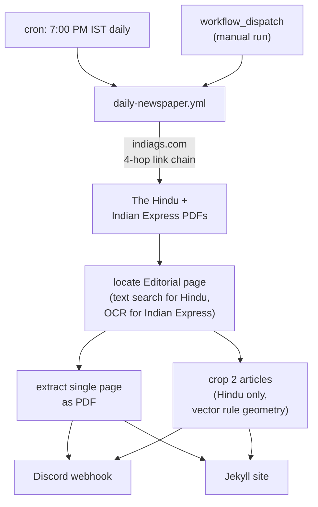
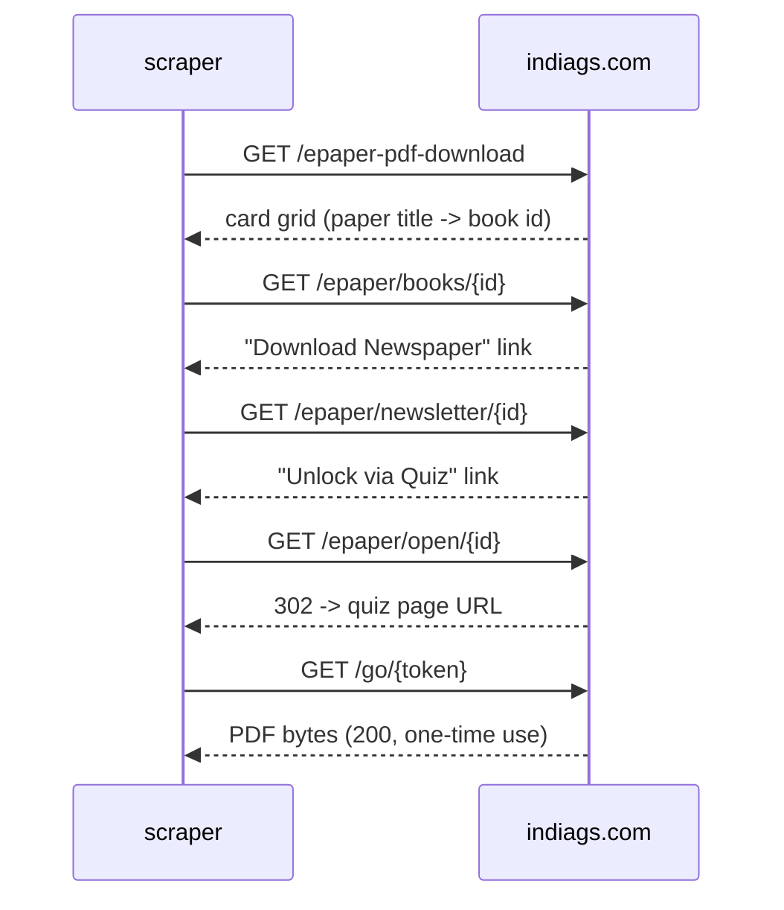
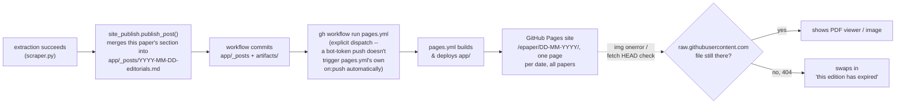

# E-Paper Editorial Extractor

Pulls the Editorial page out of today's **The Hindu** and **Indian Express** e-papers and posts it to Discord — the single page as a PDF, plus (for The Hindu) each main article cropped out as its own image. Runs on a GitHub Actions cron, no server to maintain.

[](https://www.python.org/)
[](LICENSE)

## How it works

One GitHub Actions workflow, one source (indiags.com), both papers. It's a plain HTTP scraper — no Selenium, no headless browser, no Chrome install. Every page in the chain is static server-rendered HTML or a direct file link; nothing here needs JavaScript execution.



### Source: indiags.com

`scraper.py` covers both papers by walking a four-hop link chain per paper, entirely with `requests`:



The site's UI wraps this in a quiz-unlock button, a 15-second countdown banner, and assorted popups — all client-side theater. The server embeds the one-time download token in the redirect response the moment `/epaper/open/{id}` is requested, regardless of whether a human ever clicks anything. The `/go/{token}` link is genuinely single-use: a second request against the same token returns an HTML page instead of the PDF, so it's fetched exactly once and streamed straight into the extraction step, never posted as a raw link.

**Parse the unlock fragment as a query string, not by splitting on `unlock=`.** The redirect fragment carries two keys — `unlock=<url-encoded /go/ link>&exp=<epoch>`. Taking everything after `unlock=` glues `&exp=...` onto the end of the token path, and every download 404s. `urllib.parse.parse_qs` on the fragment is what `resolve_token_url()` uses; assume the site will keep adding keys there.

**The session is IPv4-only with connect retries** (`build_session()`). indiags sits behind a Hostinger CDN publishing both A and AAAA records, and intermittently refuses connections from CI runners for a few minutes at a time. GitHub Actions runners have no IPv6 egress, so every AAAA address is a guaranteed `ENETUNREACH` — and since `urllib3`'s connect loop raises only the *last* error it saw, those IPv6 failures mask the real IPv4 error and make a plain CDN blip look like a routing bug. Pinning `allowed_gai_family` to `AF_INET` keeps the reported error honest, and the retry/backoff on the adapter keeps a transient blip from costing the whole day's run.

Editorial-page location differs per paper because their PDFs are structured differently:

- **The Hindu** — clean text layer; the masthead always carries a standalone line reading exactly `Editorial`, matched on the page's top text lines.
- **Indian Express** — the PDF page is a single flattened JPEG with a broken, non-Unicode-mapped text layer (glyph-indexed font, unusable for search). Located instead by OCR: the top 20% of each page is rendered and read with `pytesseract`, matching a short standalone line reading `The Editorial Page`. The length check matters — the front page also carries a teaser banner ("*The Editorial Page: SC has nurtured environmental law...*") pointing readers to the real page, which contains the same phrase but as a long sentence with a colon, not a bare masthead line. Matching only short lines tells them apart reliably.

If no page matches, the paper didn't run an editorial that day (Sunday, holiday) and the run skips that paper cleanly rather than guessing.

The Hindu's PDF carries vector rule geometry, so its two main articles are cropped from the page. `PyMuPDF`'s `get_drawings()` returns the exact rules the page was laid out with:

- a full-height vertical rule marks off the left sidebar (short filler pieces) — excluded
- horizontal rules within the remaining content column bound each article, in order
- The Hindu always runs exactly two main articles on this page, followed by Letters to the Editor, which is dropped unconditionally

Each article is rendered to a high-resolution PNG from its exact rule-bounded region. Indian Express stays single-page-PDF-only: its PDF is a flattened raster page with no vector drawings, and no printed rule line is reliably detectable at the pixel level either (tested down to per-row dark-run analysis at 200 DPI — the section dividers visible on the printed page don't survive as a clean signal in the compressed raster). Rule-based article cropping just isn't viable there.

### Guardrails

Both real breakages so far were *silent* — a green workflow producing nothing. preppyq's paywall hid for six consecutive runs, and the `&exp=` change 404'd every download while the run still reported success. So the guards are aimed less at any particular future change than at the failure *mode*: looking fine while doing nothing.

**Link resolution is ranked by how stable the locator is** (`_resolve_link()`). The URL path shape (`/epaper/newsletter/{id}`) comes first — the author can't change it without breaking their own routing — with the CSS class and then the button label as fallbacks. The original code used only the last two, which is why a theme tweak or a copy edit would have taken the whole run down. Verified against mutated copies of the live homepage: stripping *every* `class` attribute, renaming all three card classes, and rewording the paper titles to "The Hindu ePaper" / "Indian Express (Delhi)" all still resolve correctly.

Which locator actually fired is recorded in history as `resolved_via`, and anything other than `url-shape` logs a warning. That's the early-warning signal: the fallbacks firing means the shape moved and the chain is running on borrowed time, visible *before* it breaks.

**The one-time `/go/` token is looked for in three places** (`_extract_go_url()`) — fragment as a query string, then the query string proper, then anything `/go/`-shaped in the response body. The site has already moved this once; parsing the fragment with `parse_qs` means further added keys are a non-event.

**A run of skips is reported** (`common.consecutive_skips()`). A single `skipped_not_published` is normal — neither paper publishes an editorial every day, and the pattern is irregular (Sunday 23-08-2026 published; the Sundays either side didn't). A *streak* is not: the longest genuine one on record is a single day. Three in a row fails the run and reports instead of recording another quiet skip. Two details matter — days with no entry are stepped over (the workflow doesn't run every day, and a gap is not evidence), and an entry from a different `source` ends the walk, so switching sources doesn't inherit the previous one's streak. Checked against the real history: it trips on 02-09-2026, the third day of the preppyq outage, and stays silent on the genuine one-day gaps.

**Problems are reported, not delivered, by the scraper** (`common.report_problem()`). Nothing diagnostic goes to Discord — that webhook points at a public community server, so it stays single-purpose: posting editorials. Instead each problem is written to three places that need no secret at all — a GitHub Actions annotation (called out inline on the run page), `$GITHUB_STEP_SUMMARY` (so the run page explains itself), and `failure-report.md`.

The workflow turns that file into **a GitHub Issue**, which is what actually reaches an inbox: GitHub mails the full issue body from `notifications@github.com`, alongside the automated run-failure mail — whose own template can't carry custom text, which is why the issue exists at all. One open issue at a time, matched on exact title, so a break persisting for days adds comments rather than mailing a new issue every run; a later clean run comments "Recovered" and closes it. The issue step runs on success too, because the early-warning report fires while everything still works.

`HopError` also writes the offending page to `hop-{what}.html`, collected by the workflow's `upload-artifact` step — previously that step was dead, since nothing ever wrote a `*.html` file. None of these diagnostics are committed (they're in `.gitignore`, which matters because the workflow commits with `git add -A`).

**This needs Issues enabled on the repo.** The step runs with `issues: write` on the default `GITHUB_TOKEN`; if Issues are turned off, `gh issue list` fails and the step goes red.

### Why preppyq.in was dropped

The original primary source was `preppyq.in`, a static WordPress page listing direct PDF links for The Hindu. It went behind a paywall: the table's links now point at `rzp.io` Razorpay payment pages instead of PDFs. That failed *silently* — the scraper downloaded the payment page's HTML, found no `Editorial` text in it, and recorded the day as `skipped_not_published`, so the workflow kept reporting success while producing nothing. Removed entirely rather than kept as a fallback; a source that fails by looking like a quiet no-op is worse than no source.

## The site

The scraper publishes into a single Jekyll post per date (`site_publish.py`), so the day's output — however many papers ran — lands on one page instead of one per paper, on a small static site (`app/`, a customized [jekyll-swiss](https://github.com/broccolini/swiss) theme) in addition to Discord.



**One post per date, not per paper.** `app/_posts/YYYY-MM-DD-editorials.md` is built from marked-off per-paper sections (`<!-- paper-section:TH -->...<!-- /paper-section:TH -->`); a re-run only replaces the section for the paper it just processed, in a fixed order, so The Hindu and Indian Express never stomp on each other regardless of which ran first or how many times. URL is `/epaper/DD-MM-YYYY/` (`permalink: /epaper/:day-:month-:year/` in `_config.yml`), title "Editorials of DD/MM/YYYY". Content per paper: H1 paper name, H2 sections (Editorial/Articles as applicable), a download-button table (`app/_includes/download-button.html`, using `app/assets/download.svg`) for every downloadable file, and an inline PDF preview.

**PDF preview is a self-hosted PDF.js** (`app/assets/pdfjs/`, vendored from [mozilla/pdf.js](https://github.com/mozilla/pdf.js) releases, trimmed of source maps/sample files/most locales down to English + Hindi), not a plain `<iframe src="raw-url">`. Directly framing a `raw.githubusercontent.com` URL doesn't reliably render inline — GitHub serves raw content with headers that push browsers toward downloading rather than displaying it. PDF.js sidesteps that: the iframe points at our own `web/viewer.html?file=<url-encoded raw URL>`, and PDF.js fetches the PDF bytes itself and renders to canvas — `raw.githubusercontent.com` allows CORS, so the fetch works regardless of how the response would have behaved as a page navigation.

One hand-patch on top of the vendored files: PDF.js's `viewer.mjs` hardcodes a same-origin check (`validateFileURL`) that only exempts Mozilla's own `mozilla.github.io` demo from loading a different-origin file via `?file=` — any other self-hosted deployment gets silently blocked (an empty viewer, no console-visible network failure, since it throws before ever fetching). Since every URL we pass is one we constructed ourselves from our own repo, never arbitrary input, our deployment origin (`https://mantavyam.github.io`, plus `http://localhost:4000` for local preview) is added to that allowlist directly in `app/assets/pdfjs/web/viewer.mjs` — the same trust model Mozilla applies to their own domain. **Re-apply this patch if `app/assets/pdfjs/` is ever re-vendored from a newer PDF.js release** — search `viewer.mjs` for `HOSTED_VIEWER_ORIGINS`.

Posts don't duplicate the PDF/PNG files into the site — they link straight to `raw.githubusercontent.com/.../artifacts/...` on `main`. That keeps `app/`'s per-day footprint tiny, at the cost of those links depending on the artifact still being in the repo. Since both `artifacts/` and `app/_posts/` are pruned on the same 7-day rolling window (`common.cleanup_stale_posts()`, alongside `cleanup_stale_artifacts()`), a post essentially never outlives its own artifact in steady state — the client-side expiry handling in `app/_includes/expiry-check.html` exists as a safety net for the brief window within a single cleanup cycle, not as the normal experience. When it does trigger: images swap to a placeholder via `onerror` (immediate, no request needed), and each download-button link runs a `fetch(..., {method: "HEAD"})` on page load and replaces itself with "This PDF has expired" if the request fails.

Site is deployed by `.github/workflows/pages.yml` (Jekyll build via `ruby/setup-ruby` + `actions/deploy-pages`, `jekyll-sass-converter` pinned to the pure-Ruby v2 line rather than the default `sass-embedded` for one less native-binary dependency in CI) on every push to `app/**`, manually via `workflow_dispatch`, or explicitly dispatched by the daily workflow's last step (needed because its own commit is pushed with `GITHUB_TOKEN`, which GitHub deliberately excludes from triggering other workflows' `on: push`). Browsing by date needs no custom code — `site.posts` is Jekyll's native reverse-chronological list; `/epaper/` (`app/epaper.html`) filters it to the `epaper` category. All post/history timestamps go through `common.now_ist()` and `_config.yml`'s `timezone: Asia/Kolkata`, not the build host's own clock (GitHub Actions runners default to UTC) — Jekyll normalizes every post date to the *build machine's* local timezone before deriving permalink components, so without pinning this explicitly, a post published in the early IST morning can silently land on the wrong calendar day.

## Repo layout

```
epaper-automation/
├── scraper.py                              # indiags.com: both papers
├── editorial.py                            # page location + extraction
├── common.py                               # history, Discord posting, cleanup
├── site_publish.py                         # writes app/_posts/ entries
├── download_history.json                   # per-paper daily dedup record
├── artifacts/YYYY-MM-DD/                   # today's extracted PDFs/PNGs (auto-pruned, 7 days)
│   ├── TH-EDITORIAL-DD-MM-YY.pdf           # single-page editorial PDF
│   ├── TH-ART1-DD-MM-YY.png                # article crop 1 (Hindu only)
│   ├── TH-ART2-DD-MM-YY.png                # article crop 2 (Hindu only)
│   └── IE-EDITORIAL-DD-MM-YY.pdf
├── app/                                     # Jekyll site (jekyll-swiss theme)
│   ├── _posts/YYYY-MM-DD-editorials.md     # one per date, all papers (auto-pruned, 7 days)
│   ├── epaper.html                          # /epaper/ -- browsable archive
│   ├── _includes/download-button.html      # reusable download link + expiry check hook
│   ├── _includes/expiry-check.html         # client-side expired-artifact handling
│   └── assets/pdfjs/                        # vendored PDF.js (self-hosted inline viewer)
├── requirements.txt
└── .github/workflows/
    ├── daily-newspaper.yml                 # cron + manual dispatch
    └── pages.yml                           # builds + deploys app/ to GitHub Pages
```

## Setup

1. **Discord webhook** — Server Settings → Integrations → Webhooks → create one, copy the URL.
2. **Repo secret** — Settings → Secrets and variables → Actions → add `DISCORD_WEBHOOK_URL`.
3. Enable Actions on the repo. The workflow runs on its own cron; no further setup needed.
4. **GitHub Pages** — Settings → Pages → set Source to "GitHub Actions" (one-time; `pages.yml` handles builds after that).

For local runs, copy `.env.example` to `.env` or export `DISCORD_WEBHOOK_URL` directly, then:

```bash
pip install -r requirements.txt
python scraper.py
```

`pytesseract` needs the `tesseract-ocr` binary on PATH (`brew install tesseract` / `apt-get install tesseract-ocr`) — only exercised by Indian Express detection.

## Running manually

The workflow can be triggered off-schedule from the **Actions** tab (`Run workflow`) or via `gh`:

```bash
gh workflow run daily-newspaper.yml
gh workflow run pages.yml
```

`pages.yml` also runs automatically on every push that touches `app/**` (which every extraction run does, via the new post file), so a manual run of it is rarely needed.

## History and artifact lifecycle

`download_history.json` is keyed `MM-YYYY -> YYYY-MM-DD -> paper name`, recording whether that paper was posted, skipped (no editorial published that day), or failed, plus the source it came from and which locator resolved the chain (`resolved_via`). The scraper checks this before doing any work, so re-running the workflow the same day is a no-op for papers already posted.

Extracted files land in `artifacts/YYYY-MM-DD/`, named `{PAPER_CODE}-{DOC_TYPE}[N]-DD-MM-YY.{ext}` (`TH` for The Hindu, `IE` for Indian Express; `EDITORIAL` for the single-page PDF, `ART1`/`ART2` for The Hindu's article crops) so the paper, content, and date are readable from the filename alone. They're committed by the workflow. Every run also prunes any date folder older than **7 days**, and the corresponding `app/_posts/` entries on the same window, so the repo stays a rolling week of history rather than accumulating indefinitely.

## Dependencies

`requests`, `urllib3`, `beautifulsoup4`, `pymupdf`, `pytesseract`, `Pillow` — all pure-Python/HTTP, no browser runtime.

PyMuPDF is imported as `import pymupdf`, not the legacy `import fitz` alias — deprecated since 1.24.0, and the source of the `fitz API is deprecated` warning that used to head every run log. Log timestamps go through `common.configure_logging()` so they read in IST like the rest of the system, instead of the runner's UTC clock.

## License

See [LICENSE](LICENSE).
