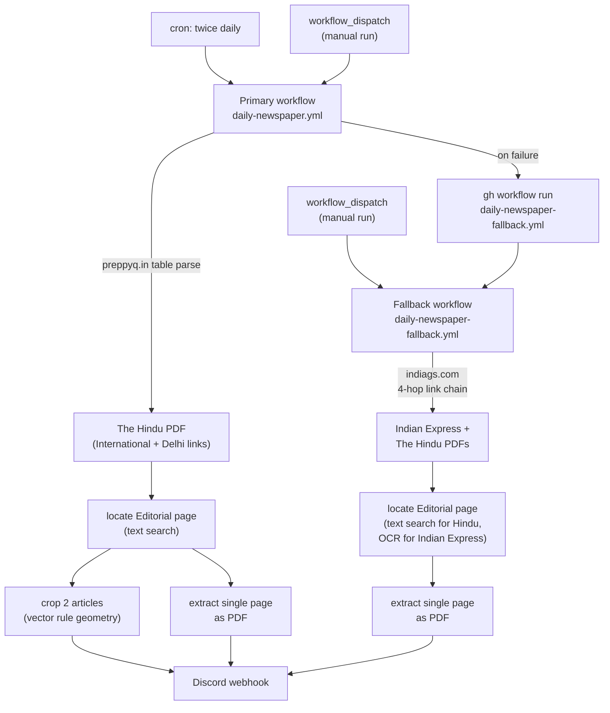
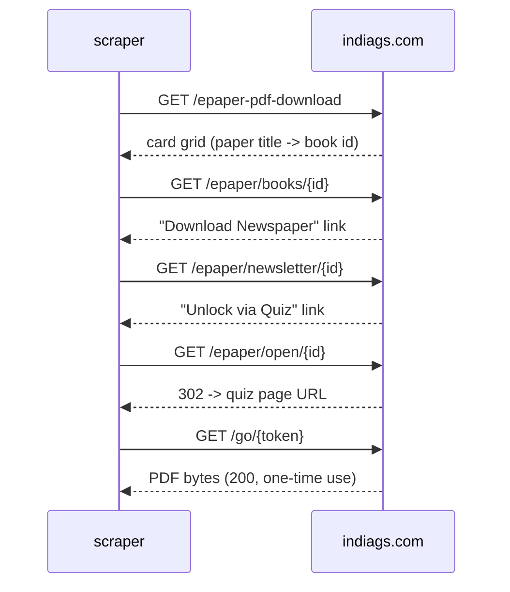

# E-Paper Editorial Extractor

Pulls the Editorial page out of today's **The Hindu** and **Indian Express** e-papers and posts it to Discord — the single page as a PDF, plus (for The Hindu) each main article cropped out as its own image. Runs on a GitHub Actions cron, no server to maintain.

[](https://www.python.org/)
[](LICENSE)

## How it works

Two independent GitHub Actions workflows, one primary and one fallback. Both are plain HTTP scrapers — no Selenium, no headless browser, no Chrome install. Every source page involved is either static server-rendered HTML or a direct file link; nothing here needs JavaScript execution.



### Primary: preppyq.in

`scraper.py` fetches `https://preppyq.in/the-hindu-newspaper/`, a static WordPress page whose first table lists direct PDF links for today's date (`requests` + `BeautifulSoup`, no rendering needed). Both editions' links are read; **International** is downloaded for extraction (fewer ads than Delhi, identical editorial content) with Delhi kept as the alternate if International isn't listed that day.

The Editorial page is located by text: The Hindu's PDF has a clean text layer, and its masthead always carries a standalone line reading exactly `Editorial` near the top of the page. If no page matches, the paper didn't run an editorial that day (Sunday, holiday) and the run skips cleanly rather than guessing.

Article cropping uses the PDF's own vector geometry, not pixel analysis. `PyMuPDF`'s `get_drawings()` returns the exact rules the page was laid out with:

- a full-height vertical rule marks off the left sidebar (short filler pieces) — excluded
- horizontal rules within the remaining content column bound each article, in order
- The Hindu always runs exactly two main articles on this page, followed by Letters to the Editor, which is dropped unconditionally

Each article is rendered to a high-resolution PNG from its exact rule-bounded region. The full Editorial page is also saved as its own small single-page PDF. Both edition URLs, the two article PNGs, and the single-page PDF are posted to Discord together.

### Fallback: indiags.com

Only runs if the primary workflow fails, or when triggered manually. `fallback_scraper.py` covers both papers by walking a four-hop link chain per paper, entirely with `requests`:



The site's UI wraps this in a quiz-unlock button, a 15-second countdown banner, and assorted popups — all client-side theater. The server embeds the one-time download token in the redirect response the moment `/epaper/open/{id}` is requested, regardless of whether a human ever clicks anything. The `/go/{token}` link is genuinely single-use: a second request against the same token returns an HTML page instead of the PDF, so it's fetched exactly once and streamed straight into the extraction step, never posted as a raw link.

Editorial-page location differs per paper because their PDFs are structured differently:

- **The Hindu** — same clean text layer as the primary source, same exact-line match on `Editorial`.
- **Indian Express** — the PDF page is a single flattened JPEG with a broken, non-Unicode-mapped text layer (glyph-indexed font, unusable for search). Located instead by OCR: the top 20% of each page is rendered and read with `pytesseract`, matching a short standalone line reading `The Editorial Page`. The length check matters — the front page also carries a teaser banner ("*The Editorial Page: SC has nurtured environmental law...*") pointing readers to the real page, which contains the same phrase but as a long sentence with a colon, not a bare masthead line. Matching only short lines tells them apart reliably.

No per-article image cropping on this path — IE's flattened-raster pages have no vector rule data to key off (unlike the Hindu PDFs), so it's kept to the single editorial-page PDF only, delivered as a Discord attachment.

## Repo layout

```
epaper-automation/
├── scraper.py                              # primary: preppyq.in
├── fallback_scraper.py                     # fallback: indiags.com
├── editorial.py                            # shared: page location + extraction
├── common.py                               # shared: history, Discord posting, cleanup
├── download_history.json                   # per-paper daily dedup record
├── artifacts/YYYY-MM-DD/                   # today's extracted PDFs/PNGs (auto-pruned)
│   ├── TH-EDITORIAL-DD-MM-YY.pdf           # single-page editorial PDF
│   ├── TH-ART1-DD-MM-YY.png                # article crop 1 (primary only)
│   ├── TH-ART2-DD-MM-YY.png                # article crop 2 (primary only)
│   └── IE-EDITORIAL-DD-MM-YY.pdf
├── requirements.txt
└── .github/workflows/
    ├── daily-newspaper.yml                 # primary: cron + manual dispatch
    └── daily-newspaper-fallback.yml        # fallback: manual dispatch only (or auto-triggered on primary failure)
```

## Setup

1. **Discord webhook** — Server Settings → Integrations → Webhooks → create one, copy the URL.
2. **Repo secret** — Settings → Secrets and variables → Actions → add `DISCORD_WEBHOOK_URL`.
3. Enable Actions on the repo. The primary workflow runs on its own cron; no further setup needed.

For local runs, copy `.env.example` to `.env` or export `DISCORD_WEBHOOK_URL` directly, then:

```bash
pip install -r requirements.txt
python scraper.py            # primary
python fallback_scraper.py   # fallback
```

`pytesseract` needs the `tesseract-ocr` binary on PATH (`brew install tesseract` / `apt-get install tesseract-ocr`) — only exercised by the fallback path's Indian Express detection.

## Running manually

Both workflows can be triggered independently of their schedule from the **Actions** tab (`Run workflow`) or via `gh`:

```bash
gh workflow run daily-newspaper.yml
gh workflow run daily-newspaper-fallback.yml
```

The fallback is also dispatched automatically by the primary workflow's last step when the primary run fails.

## History and artifact lifecycle

`download_history.json` is keyed `MM-YYYY -> YYYY-MM-DD -> paper name`, recording whether that paper was posted, skipped (no editorial published that day), or failed, plus which source/edition it came from. Both scripts check this before doing any work, so re-running a workflow the same day is a no-op for papers already posted.

Extracted files land in `artifacts/YYYY-MM-DD/`, named `{PAPER_CODE}-{DOC_TYPE}[N]-DD-MM-YY.{ext}` (`TH` for The Hindu, `IE` for Indian Express; `EDITORIAL` for the single-page PDF, `ART1`/`ART2` for the primary workflow's article crops) so the paper, content, and date are readable from the filename alone. They're committed by the workflow. Every run also prunes any date folder older than 4 days, so the repo doesn't accumulate newspaper PDFs indefinitely.

## Dependencies

`requests`, `beautifulsoup4`, `pymupdf`, `pytesseract`, `Pillow` — all pure-Python/HTTP, no browser runtime.

## License

See [LICENSE](LICENSE).
